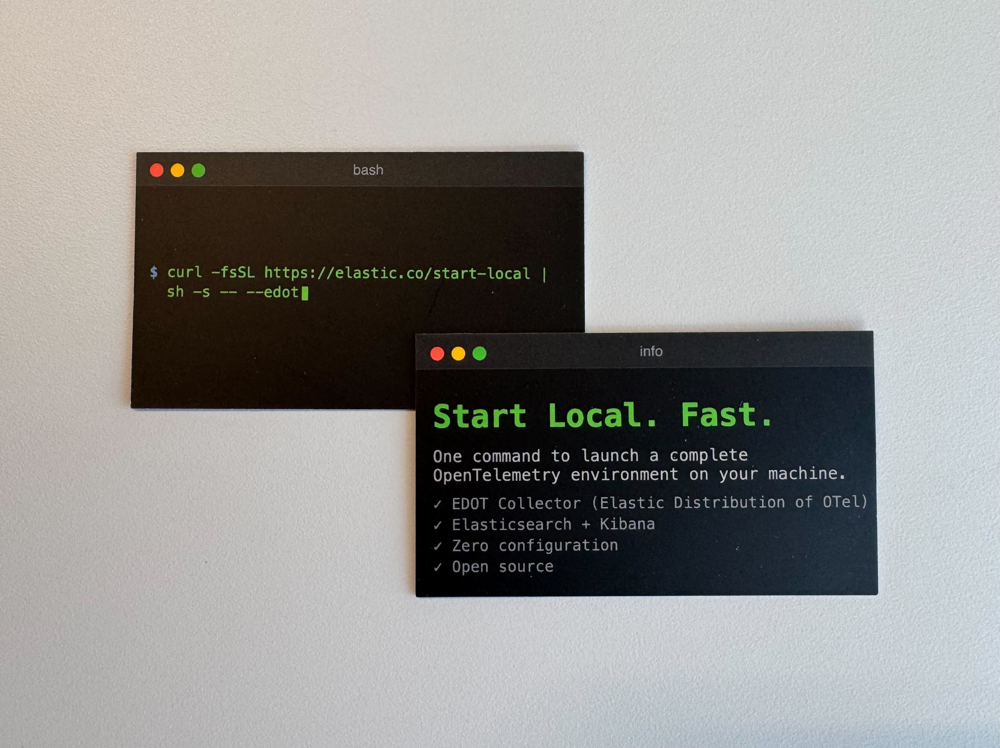

# Business Card as Code

Claude generated HTML code to build images for [Moo](https://www.moo.com) business cards. The card is too large and will extend over the borders on Moo, but this guarantees that there are no gaps on the card.

## Example

Terminal look for Elastic's [start local with EDOT](https://github.com/elastic/start-local?tab=readme-ov-file#install-the-elastic-distribution-of-opentelemetry-edot-collector).

